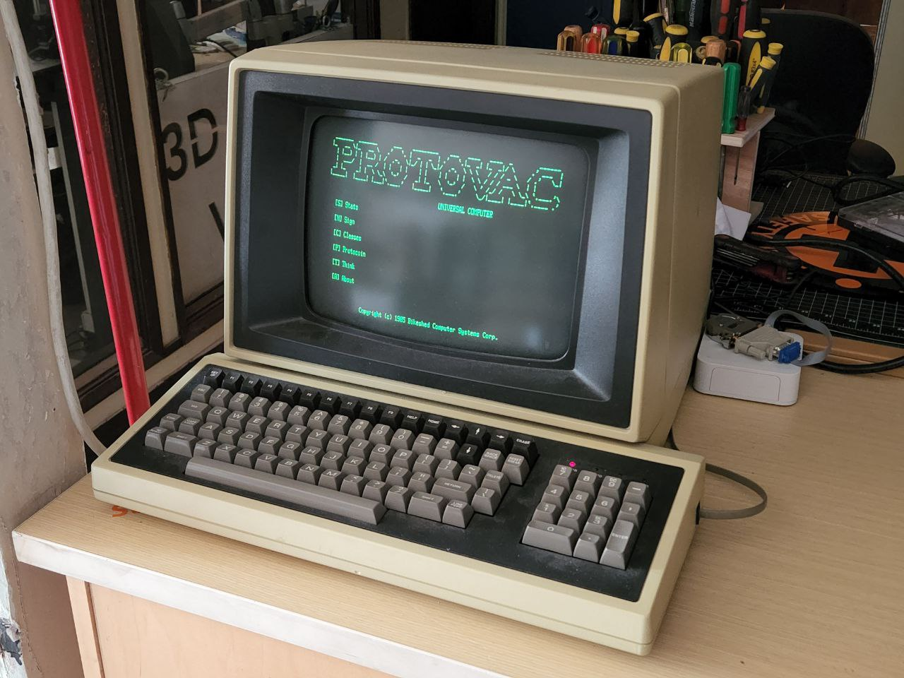

# PROTOVAC UNIVERSAL COMPUTER

Protovac is software for an old dumb terminal CRT screen that's used to display
random info about Protospace. There's a few interactive features like sending
messages to a huge marquee LED sign and performing calculations.



Here are some of its screens:

```
 _______  _______      ___    _________    ___   ____   ____  _        ______
|_   __ \|_   __ \   .'   `. |  _   _  | .'   `.|_  _| |_  _|/ \     .' ___  |
  | |__) | | |__) | /  .-.  \|_/ | | \_|/  .-.  \ \ \   / / / _ \   / .'   \_|
  |  ___/  |  __ /  | |   | |    | |    | |   | |  \ \ / / / ___ \  | |
 _| |_    _| |  \ \_\  `-'  /   _| |_   \  `-'  /   \ ' /_/ /   \ \_\ `.___.'\
|_____|  |____| |___|`.___.'   |_____|   `.___.'     \_/|____| |____|`.____ .'

                                         UNIVERSAL COMPUTER

   [S] Stats

   [N] Sign

   [C] Classes

   [P] Protocoin

   [T] Think

   [A] About


              Copyright (c) 1985 Bikeshed Computer Systems Corp.
```

```
PROTOVAC UNIVERSAL COMPUTER

Protospace Stats
================

Next meeting: Thu Sep 15, 2022  7:00 PM

Next clean:   Sat Sep 17, 2022  10:00 AM

Next class:   Vinyl Cutting and Application Course
              Sat Sep 10, 2022  2:00 PM

Last class:   Metal: Metal Cutting & Manual Lathe
              Sat Sep 3, 2022  10:00 AM

Member count: 249   Green: 208   Paused / expired: 1209

Card scans:   14


[B] Back
```

```
PROTOVAC UNIVERSAL COMPUTER

Protospace Sign
===============

Send a message to the sign in the welcome room and classroom.
After sending, turn your head right and wait 5 seconds.

   [E] Edit message


[B] Back
```

```
PROTOVAC UNIVERSAL COMPUTER

Protospace Classes
==================              Instructor    Cost     Students

New Member Orientation and Safety
Sun Aug 28, 2022  2:00 PM       Scott Y.      Free     6 / 6

New Member Orientation and Safety
Fri Sep 2, 2022  7:00 PM        Tim G.        Free     6

Woodworking Tools 1: Intro to Saws
Sun Sep 11, 2022  2:00 PM       Vince K.      $20.00   8 / 8

Laser II: Trotec (Requires Laser I)
Sun Aug 28, 2022  11:00 AM      Jack W.       $30.00   3 / 5

Monthly Members Meeting
Thu Sep 15, 2022  7:00 PM       Protospace    Free     0

Monthly Cleanup and Group Lunch
Sat Sep 17, 2022  10:00 AM      Protospace    Free     2

[B] Back  [J] Down  [K] Up
```

```
PROTOVAC UNIVERSAL COMPUTER

Protocoin
=========

Protocoin is used to buy things from Protospace's vending machines.

Total in circulation: 70.0

Transactions:

ID     Date        Method       Amount  Category
44130  2022-08-31  Protocoin    1.00    Transfer
44129  2022-08-31  Protocoin    -1.00   Transfer
44109  2022-08-29  PayPal       10.00   Exchange
44068  2022-08-26  PayPal       10.00   Exchange
44062  2022-08-24  PayPal       10.00   Exchange
44055  2022-08-24  PayPal       20.00   Exchange
44053  2022-08-23  Protocoin    1.00    Transfer
44052  2022-08-23  Protocoin    -1.00   Transfer
44048  2022-08-23  PayPal       19.00   Exchange
44047  2022-08-23  PayPal       1.00    Exchange

[B] Back  [J] Down  [K] Up
```

```
PROTOVAC UNIVERSAL COMPUTER

Think
=====

Give Protovac something to think about.

   [E] Edit prompt

Examples:

   42 + 69
   55 kg to lbs
   density of lead
   if x = 4, what is 3x + 50?
   force m=150g, a=50cm/s^2
   boiling point of benzene at 550 torr
   goats with highest milk yield
   how long did the Aztec empire last?


[B] Back
```

## Setup

### SD Card

Format SD card, mount on your own system.

```
$ cd boot/  # on SD card
$ touch ssh
$ touch wpa_supplicant.conf
```

Edit `wpa_supplicant.conf`:

```
country=CA
ctrl_interface=DIR=/var/run/wpa_supplicant GROUP=netdev
network={
    ssid="YOUR_NETWORK_NAME"
    psk="YOUR_PASSWORD"
    key_mgmt=WPA-PSK
}
```

Append to `config.txt`:

```
enable_uart=1
```

Optionally set up a cronjob:

```
$ cd rootfs/  # on SD card
$ sudo touch var/spool/cron/crontabs/pi
```

Edit `var/spool/cron/crontabs/pi` (optional):

```
*/5 * * * *  # example command that runs every 5 minutes
```

### On the Raspberry Pi

SSH into the Raspberry Pi.

Change the hostname:

```
sudo hostnamectl set-hostname protovac
```

Replace "raspberry" with "protovac" in `/etc/hosts`.

Edit `/lib/systemd/system/serial-getty@.service`:

```
ExecStart=-/sbin/agetty --autologin protospace 9600 %I mt70
```

Edit `/etc/passwd`:

```
protospace:x:1001:1001:,,,:/home/protospace:/home/tanner/protovac/main.py
```

```
$ git clone https://github.com/Protospace/protovac.git
$ cd protovac
$ sudo tic -o /lib/terminfo/ mt70
$ sudo apt update
$ sudo apt install python3 python3-dev python3-pip python3-virtualenv
$ virtualenv -p python3 env
$ source env/bin/activate
(env) $ pip install -r requirements.txt
(env) $ python main.py
```

Restart:

```
sudo systemctl daemon-reload
sudo systemctl restart serial-getty@ttyS0.service
```
